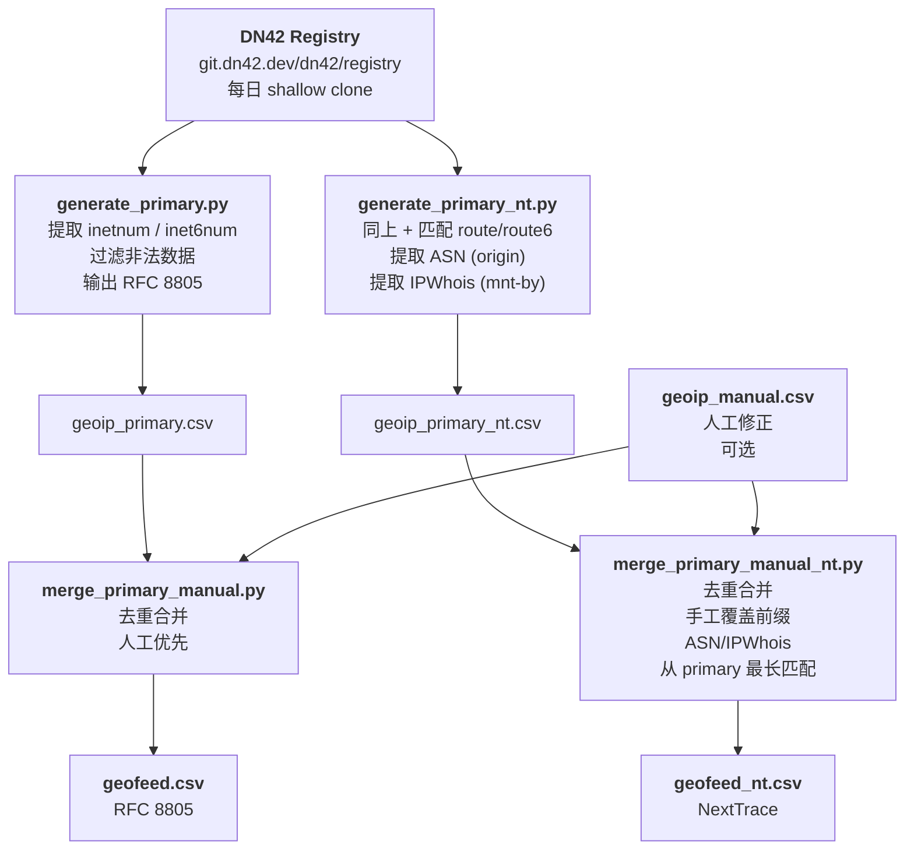

# dn42-geoip

从 [DN42 Registry](https://git.dn42.dev/dn42/registry) 自动生成 GeoFeed 数据，通过 GitHub Actions 每日发布 Release。

## 输出

每个 Release 包含两种格式：

| 文件 | 规范 | 字段 |
|---|---|---|
| `geofeed.csv` | [RFC 8805](https://datatracker.ietf.org/doc/html/rfc8805) | `prefix, country_code, region, city, postal_code` |
| `geofeed_nt.csv` | NextTrace 6 列 | `IP_CDIR, LtdCode, ISO3166-2, CityName, ASN, IPWhois` |

## 管线



## 校验

来自 registry 的原始数据可能包含格式错误。`validate.py` 在生成阶段拦截并丢弃不合法的条目：

| 检验项 | 规则 | 示例（已发现） |
|---|---|---|
| CIDR | `ipaddress.ip_network(…, strict=True)` 通过 | `10.0.0.1/24` — 主机位非零 |
| country | 恰好 2 位大写 ASCII 字母 | `USA`、`cn`、`Sumeru`、`DN42` |
| ASN | 空值或 `AS\d+(;AS\d+)*` | 非法 ASN 被清空，不阻塞输出 |

所有被丢弃的条目输出到 stderr，方便审计。

## 手工修正

编辑 `geoip_manual.csv`，仅在需要覆盖 registry 数据时添加行：

```csv
prefix,country_code,region,city,postal_code
172.22.159.0/27,CA,CA-ON,Toronto,
```

- 相同前缀覆盖自动生成的数据
- 后四列均可留空
- NextTrace 输出中的 ASN / IPWhois 由程序从 primary 数据按最长前缀匹配自动补全

## CI

- **触发**：每日 UTC 00:07（schedule）+ 手动 `workflow_dispatch`
- **运行环境**：`ubuntu-latest`
- **前置条件**：仓库 Secrets 中配置 `DN42_SSH_KEY`，用于 `git clone` registry

## 许可

[MIT](LICENSE)
